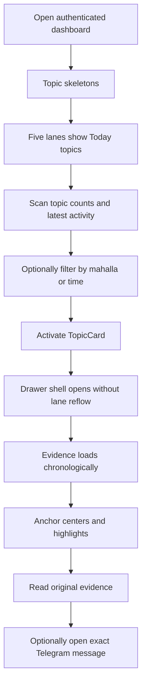
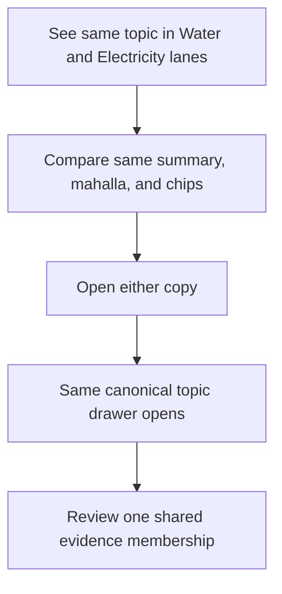
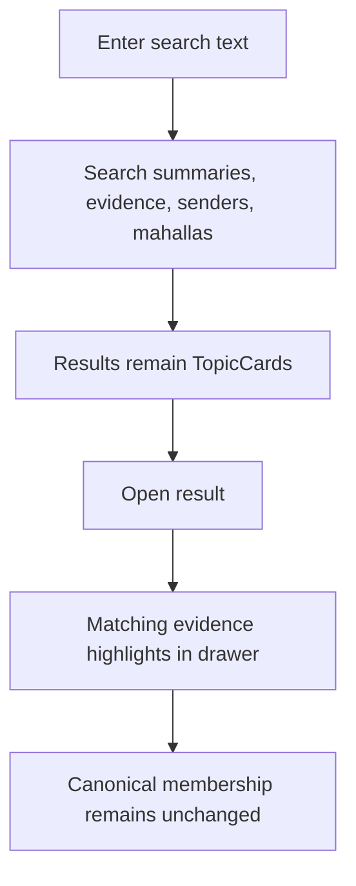

# User Journey Flows

## Journey 1 — On-Demand Topic Scan

The amber delay banner never blocks cached topic inspection.

## Journey 2 — Multi-Category Topic

Lane duplication must not create separate selected-topic state or separate
counts inside one lane.

## Journey 3 — Search and Evidence Match

## Journey 4 — Source Verification

The user activates the card's or evidence row's **Open in Telegram** link. The
link opens only when an exact URL is constructible. Telegram controls group
access. The dashboard never substitutes a group root or approximate position.

## Journey Patterns

- Filter → scan → select → inspect → verify.
- API boundaries use skeletons; already-cached operations do not.
- Background refresh preserves user state where practical.
- Swapping topics is cheaper than closing and reopening.
- Degraded states retain cached content and use calm language.
