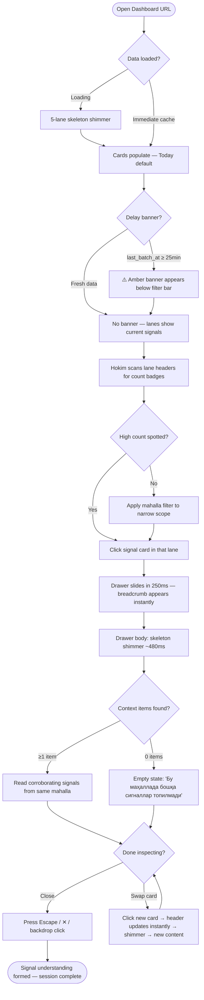
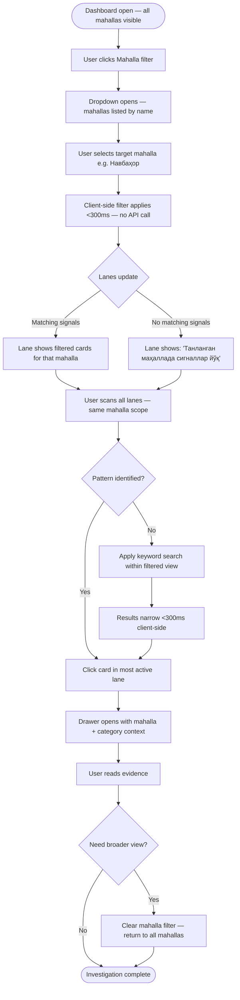
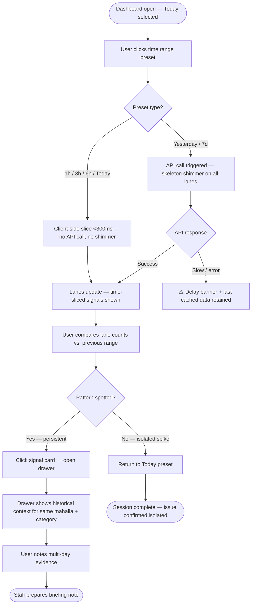

# User Journey Flows

## Journey 1: On-Demand Signal Scan (Primary — Hokim)

**Goal:** Hokim opens the dashboard whenever situational awareness is needed, identifies the most pressing district issue, and forms an evidence-based understanding in under 60 seconds.

**Entry point:** Dashboard URL opens to default “Today” time range. All 5 lanes populate via skeleton shimmer → real cards.

**Optimization notes:**
- Steps A→D must complete within 2 seconds (NFR1) to avoid perceived lag.
- The delay banner must never block lane content — informational only, no action required.
- Card swap (step S) must feel instant: header breadcrumb updates before the API call resolves.

---

## Journey 2: Mahalla Deep-Dive (Focused Investigation — Hokim or Staff)

**Goal:** User narrows the dashboard to a specific mahalla after receiving a verbal report, and reviews all active signals across all categories simultaneously.

**Entry point:** Dashboard already open. User interacts with the Mahalla filter control.

**Optimization notes:**
- MVP mahalla dropdown only needs clear mahalla selection. Signal counts inside dropdown options are optional post-pilot polish, not a pilot requirement.
- Filter state persists across drawer open/close cycles. It resets only on explicit “Clear” action.
- Clearing the filter must restore the pre-filter scroll positions in all lanes.

---

## Journey 3: Time-Range Shift Investigation (Pattern Discovery — Staff)

**Goal:** Staff member suspects a recurring issue. They shift the time range to check whether a category has a new spike or an ongoing multi-day pattern.

**Entry point:** Dashboard open with “Today” active. User clicks a time range preset.

**Optimization notes:**
- Preset ranges (1h, 3h, 6h, Today) are client-side only — no shimmer, no API call.
- Only “Yesterday” and “7d” require a new API fetch with skeleton shimmer.
- The active time preset must always show a visually distinct active chip state.
- Custom date range picker (max 7-day window) uses AntD `DatePicker.RangePicker` inline below the filter bar — not a modal.

---

## Journey Patterns

**Pattern 1 — Filter → Scan → Click → Read (The Core Loop)**
Every journey reduces to this 4-step rhythm. All design decisions must optimize this sequence. Any interaction that adds steps between Filter and Read is a regression.

**Pattern 2 — Client-Side Operations are Always Instant (<300ms)**
All filter changes on already-fetched data must never show loading states. The boundary between client-side (instant) and server-side (API call → shimmer) operations must be architecturally enforced.

**Pattern 3 — State Persistence Across Interactions**
No user action resets state the user did not explicitly change. Active filter persists across drawer cycles. Scroll positions persist across filter changes. Only explicit “Clear” actions reset filters.

**Pattern 4 — Graceful Degradation on Latency**
Every API-dependent step has a defined degraded state: skeleton shimmer (initial load / context fetch), amber delay banner (batch pipeline lag). No step results in a blank screen or a red error modal.

## Flow Optimization Principles

1. **Minimize steps to evidence.** Hokim must reach corroborating evidence in ≤3 interactions from dashboard open: (1) optional filter, (2) card click, (3) drawer read.
2. **Feedback at every transition.** Skeleton shimmers confirm the system heard the click. Instant breadcrumbs confirm the drawer is responding. Active filter chips confirm scope.
3. **Error paths are calm, not alarming.** All degraded states use amber or gray — never red — and always retain the last successfully loaded data.
4. **Swapping is cheaper than reopening.** Clicking a different card while the drawer is open costs one API call — no close → click → reopen cycle required.

---

